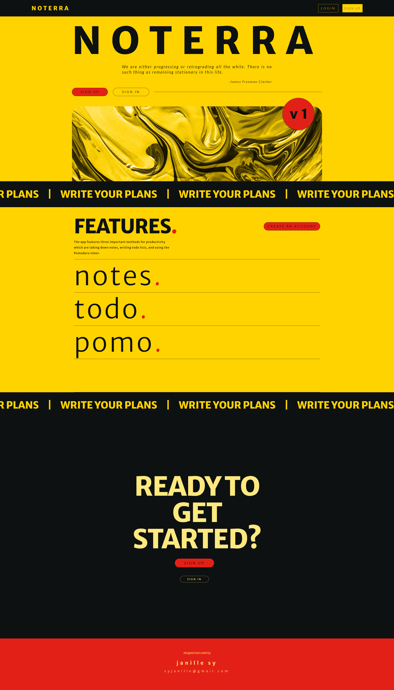
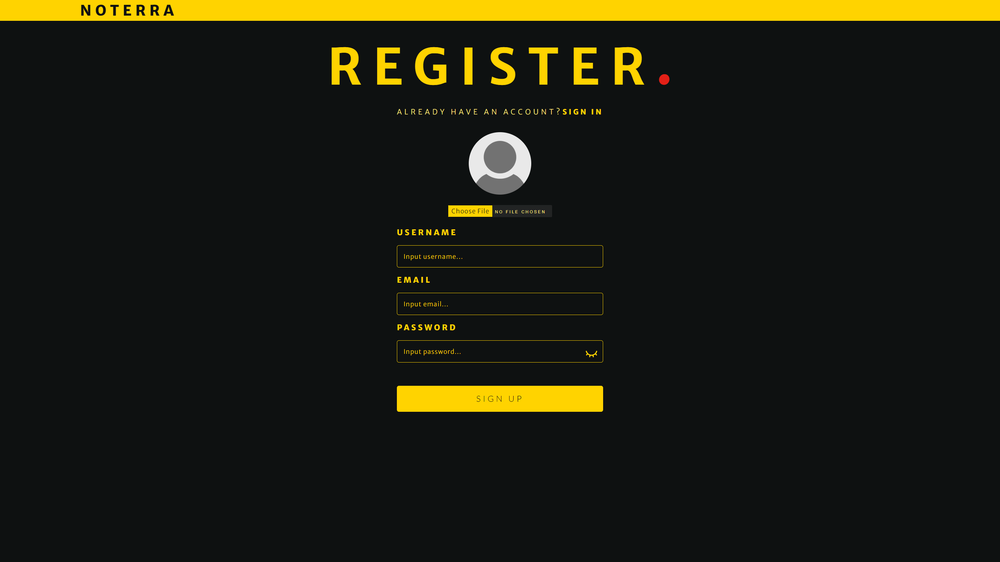
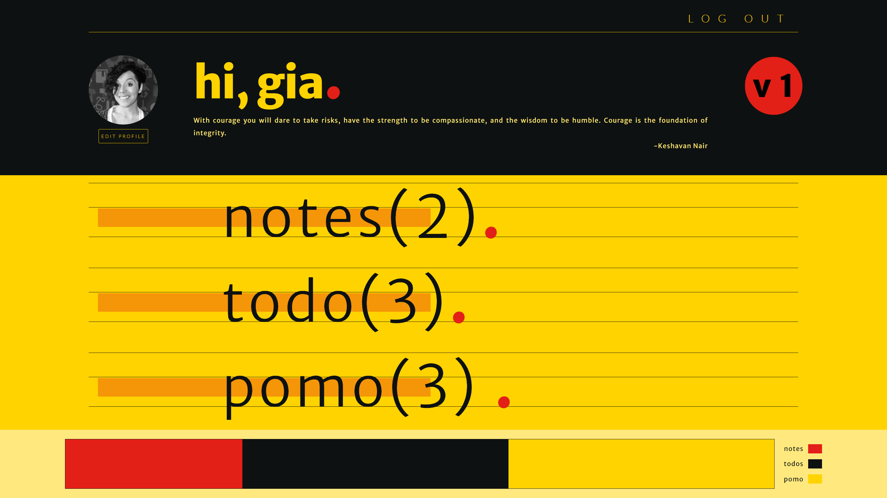
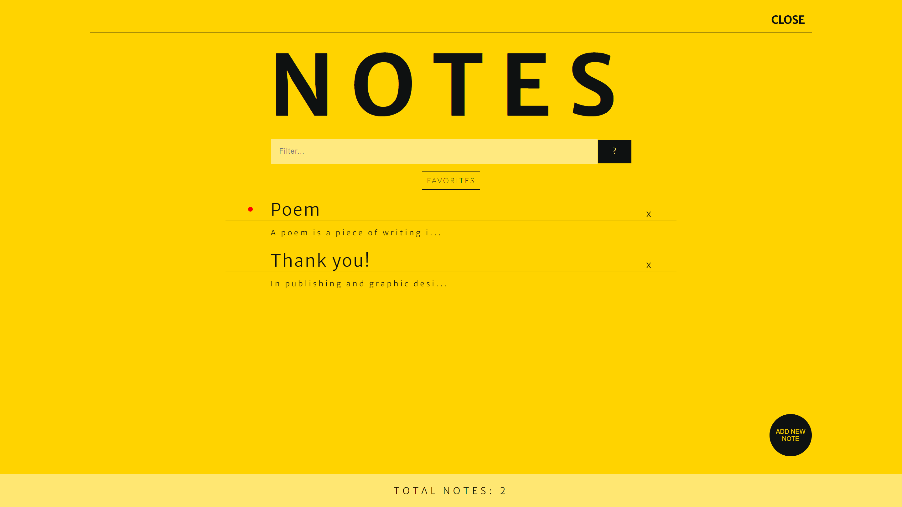
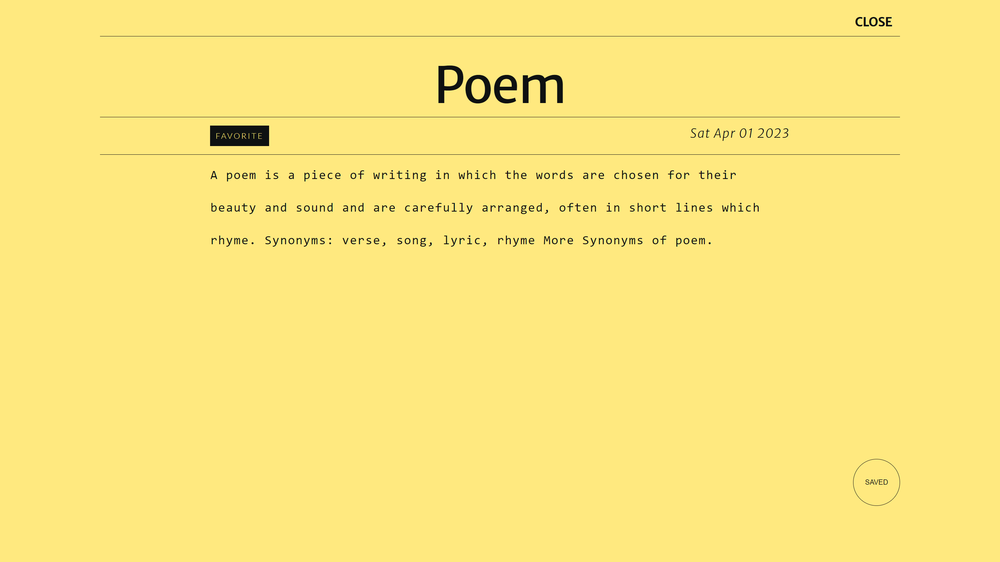
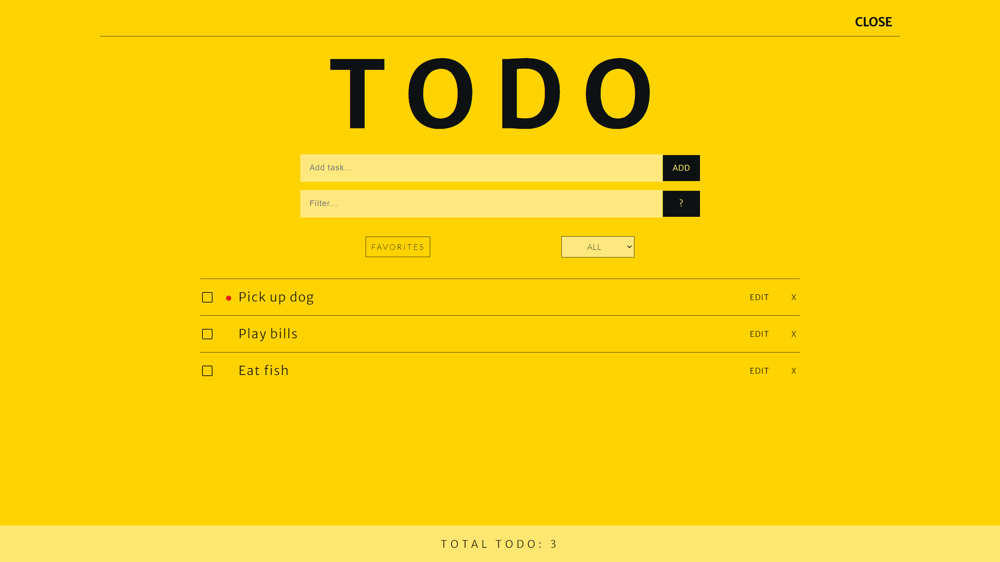
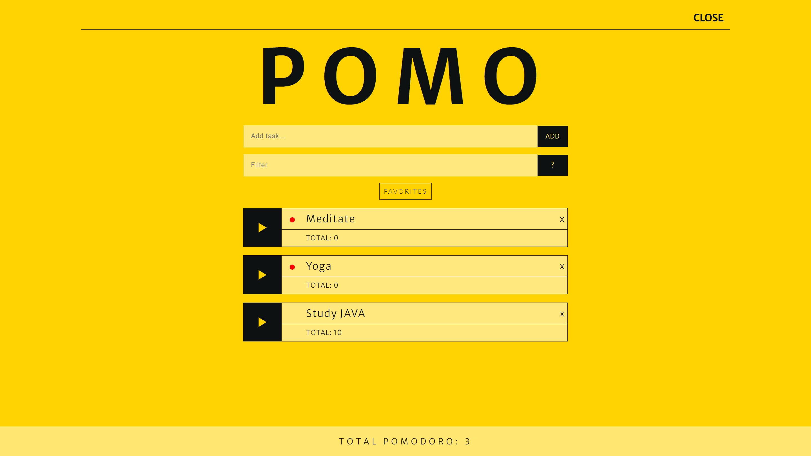

# Noterra

> This is an unguided website built with the MERN stack.It is a responsive CRUD website with authorization usingJWT and cookies.
>
> Live demo [_here_](https://noterra-app.onrender.com/dashboard).

## Table of Contents

- [Noterra](#noterra)
  - [Table of Contents](#table-of-contents)
  - [General Information](#general-information)
  - [Technologies Used](#technologies-used)
  - [Features](#features)
  - [Screenshots](#screenshots)
  - [Contact](#contact)

## General Information

Noterra is a application built with the MERN stack. It is a responsive website with authorization using JWT and cookies. The application's database is built using MongoDB, which is accessed and managed through the back-end logic of NodeJS with Express. Users interact with the front-end React components of the app to easily view, create, modify and remove data from the database. Also with the use of third-party React libraries such as Framer Motion, users interact with the interface with beautiful animations making in more appealing.

## Technologies Used

- MongoDB
- Express
- React
- NodeJS
- NoSQL
- CSS
- HTML

## Features

- Responsive website layout across multiple devices
- Page and component animations
- CRUD app with NoSQL database
- JSON Web Token for authentication

## Screenshots

## Contact

> Created by Janille Sy - feel free to contact me!
>
> EMAIL - syjanille@gmail.com
>
> MOBILE - 09268524297
